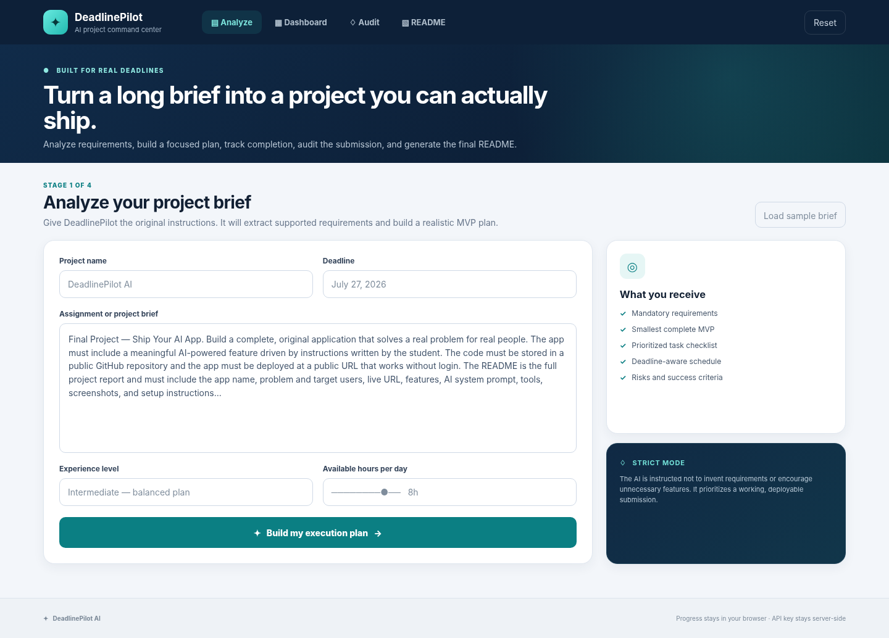
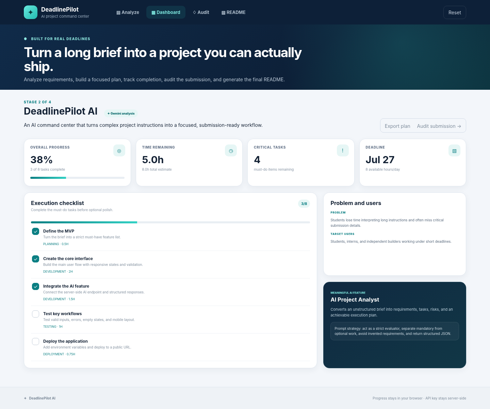
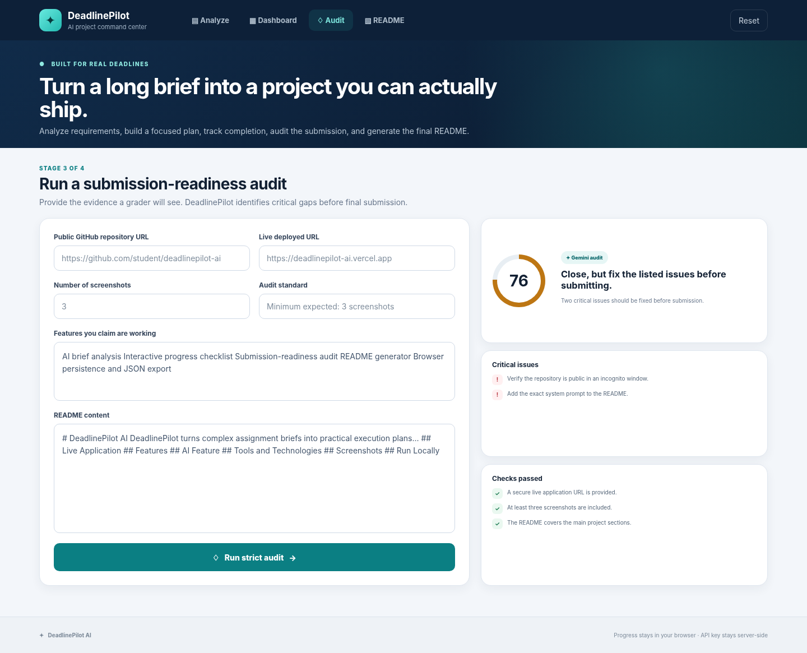

# DeadlinePilot AI

> **From a confusing project brief to a focused, submission-ready build plan.**

DeadlinePilot AI is a project-planning and submission-readiness assistant for students, interns, and independent builders working under short deadlines. A user pastes an assignment brief, and the app uses Gemini to identify compulsory requirements, recommend a realistic MVP, produce an execution checklist, estimate the work, and flag submission risks. The same workspace tracks progress, audits final evidence, and generates a complete GitHub README.

## Live Application and Repository

> **Replace the two links below after GitHub and Vercel deployment.**

- **Live application:** [https://YOUR-VERCEL-URL.vercel.app](https://YOUR-VERCEL-URL.vercel.app)
- **Public repository:** [https://github.com/YOUR-USERNAME/deadlinepilot-ai](https://github.com/YOUR-USERNAME/deadlinepilot-ai)

## The Real Problem

Project briefs often combine requirements, restrictions, grading criteria, documentation rules, and deployment instructions in one long block of text. Under time pressure, students commonly:

- Miss a small but compulsory requirement.
- Spend too long deciding where to start.
- Add unnecessary features before completing the core workflow.
- Leave deployment and documentation until the final hour.
- Claim features in the README that are not fully demonstrated.

DeadlinePilot AI gives the user one connected workflow from interpretation to final submission. It does not merely chat about an assignment; it transforms the brief into structured project data that drives an interactive application.

## Target Users

- University and college students completing software capstones.
- Interns working on time-limited technical assignments.
- Hackathon participants who need to control scope.
- Independent developers preparing project submissions or demos.

## Features

### 1. AI Project Brief Analyzer

The user enters:

- Project name
- Complete assignment brief
- Deadline
- Experience level
- Available hours per day

Gemini then returns structured project information rather than an unformatted chat response.

### 2. Requirement Extraction

The app separates the important information into:

- Mandatory requirements
- Recommended features
- Suggested technology stack
- Risks
- Success criteria

### 3. Realistic MVP Planning

DeadlinePilot is instructed to recommend the smallest complete product that satisfies the supplied brief. It prioritizes completion, testing, documentation, and deployment over unnecessary feature expansion.

### 4. Interactive Execution Checklist

Each generated task includes:

- Title and description
- Priority: Must do, Should do, or Optional
- Category: planning, design, development, testing, deployment, or documentation
- Estimated time
- Interactive completion state

### 5. Progress Dashboard

The dashboard calculates and displays:

- Overall completion percentage
- Completed and total tasks
- Remaining estimated work
- Remaining critical tasks
- Deadline and daily availability

### 6. Deadline-Aware Schedule

The generated work is grouped into ordered phases so the user can protect time for testing, deployment, screenshots, and documentation.

### 7. AI Submission Auditor

The user supplies final evidence:

- Public GitHub URL
- Live deployed URL
- Screenshot count
- Claimed feature list
- README content

The auditor returns:

- Readiness score out of 100
- Overall verdict
- Passed checks
- Critical issues
- Recommended improvements
- Final pre-submission checklist

The audit is evidence-based. It does not falsely claim that it opened or verified a supplied URL.

### 8. AI README Generator

The app produces editable Markdown containing:

- App name and one-line pitch
- Live and repository links
- Problem and target users
- Feature list
- AI feature and prompt strategy
- Technology stack
- Screenshots
- Local setup
- Environment variables
- Deployment instructions
- Privacy and security notes
- Future improvements
- License

The README can be edited, copied, and downloaded as `README.md`.

### 9. Browser Persistence

Project input, AI output, task progress, audit evidence, audit results, and README content are stored in `localStorage`. The user can refresh or close the browser without losing their work. No account or database is required.

### 10. Export and Recovery

- Export the complete project workspace as JSON.
- Download the generated README.
- Use a built-in deterministic planning and audit fallback when Gemini is temporarily unavailable.
- Reset the complete workspace from the header.

## AI Feature

### Model

The server uses **Google Gemini 2.5 Flash** through the Gemini Developer API. The model name is configurable through the `GEMINI_MODEL` environment variable.

### Why the AI Feature Is Meaningful

The AI is not a decorative chatbot. Its structured output creates the app's actual project plan, checklist, schedule, risks, success criteria, audit, and README. The user interacts with that output throughout the rest of the product.

### Main Analysis System Instruction

```text
You are DeadlinePilot AI, a strict project analyst for students and independent
builders. Extract requirements only from the supplied brief. Separate compulsory
work from helpful additions. Recommend the smallest complete MVP that can be
built by the deadline. Do not invent grading rules. Keep tasks actionable,
non-overlapping, and realistically estimated. Return only JSON matching the schema.
```

### Submission Audit System Instruction

```text
You are a demanding final-project grader. Audit the supplied submission evidence
against common requirements: original useful idea, complete end-to-end workflow,
meaningful AI feature, public repository, working live deployment, strong README,
at least three screenshots, setup instructions, documented AI prompt, and no
exposed secrets. Be specific and fair. URLs are user-provided evidence only; do
not claim you opened them. Return only JSON matching the schema.
```

### README System Instruction

```text
You write excellent GitHub README files for student software projects. Use only
supplied facts. Produce polished Markdown with the required project, AI,
screenshot, setup, deployment, security, structure, and future-work sections.
Never include a real API key. Return JSON with one markdown field.
```

### Structured Output

The API route supplies a response schema to Gemini. This reduces formatting failures and ensures that the client receives predictable properties for requirements, tasks, schedules, risks, scores, issues, and README Markdown.

### Fallback Behavior

If the API key is missing, the Gemini request fails, or the request times out, the app remains usable through a deterministic fallback engine. A visible notice tells the user when fallback output was used. The real Gemini integration remains the primary AI feature when the server environment variable is configured.

## Screenshots

### Project Brief Analyzer



### Progress Dashboard



### Submission Audit



## Tools, Services, and Technologies

| Area | Technology | Purpose |
|---|---|---|
| Full-stack framework | Next.js App Router | Interface, server rendering, and API Route Handler |
| Language | TypeScript | Safer application data and API structures |
| User interface | React | Interactive forms, navigation, task state, and editors |
| Styling | Custom responsive CSS | Original visual system without a template dependency |
| AI provider | Google Gemini Developer API | Analysis, audit, and README generation |
| AI model | Gemini 2.5 Flash | Fast structured project analysis |
| Persistence | Browser `localStorage` | Saves work without accounts or a database |
| Deployment | Vercel | Public Next.js hosting and secure environment variables |
| Source control | Git and GitHub | Public code repository and assignment submission |

## Application Architecture

```text
Browser
  ├── Analyzer form
  ├── Progress dashboard
  ├── Submission audit form
  ├── README editor
  └── localStorage persistence
          │
          ▼
Next.js Route Handler: /api/ai
  ├── Validates incoming requests
  ├── Keeps the API key server-side
  ├── Sends system instructions and JSON schemas
  ├── Normalizes Gemini output
  └── Uses deterministic fallback logic when needed
          │
          ▼
Google Gemini Developer API
```

## Project Structure

```text
deadlinepilot-ai/
├── app/
│   ├── api/ai/route.ts       # Gemini API, schemas, validation, and fallback handling
│   ├── globals.css           # Complete responsive visual system
│   ├── icon.svg              # Application icon
│   ├── layout.tsx            # Metadata and root layout
│   └── page.tsx              # Four-stage interactive workspace
├── lib/
│   ├── fallback.ts           # Offline-safe planning and audit engine
│   └── types.ts              # Shared TypeScript interfaces
├── public/screenshots/
│   ├── analyzer.png
│   ├── dashboard.png
│   └── audit.png
├── .env.example              # Safe environment-variable template
├── DEPLOYMENT_CHECKLIST.md   # GitHub, Gemini, Vercel, and final-test steps
├── LICENSE
├── README.md
├── next.config.mjs
├── package.json
└── tsconfig.json
```

## Run the Project Locally

### Requirements

- Node.js 20 or newer
- npm
- A Gemini API key from Google AI Studio for live AI output

### Installation

```bash
git clone https://github.com/YOUR-USERNAME/deadlinepilot-ai.git
cd deadlinepilot-ai
npm install
```

Copy the environment-variable example:

```bash
cp .env.example .env.local
```

On Windows Command Prompt, use:

```bat
copy .env.example .env.local
```

Add the real key to `.env.local`:

```env
GEMINI_API_KEY=your_real_gemini_api_key
GEMINI_MODEL=gemini-2.5-flash
```

Start the development server:

```bash
npm run dev
```

Open [http://localhost:3000](http://localhost:3000).

## Production Test

Run a full production build before deployment:

```bash
npm run build
npm start
```

Then test all four stages:

1. Load or paste a project brief.
2. Generate a project plan.
3. Complete and uncomplete checklist items.
4. Refresh the browser and confirm persistence.
5. Generate and edit the README.
6. Run the submission audit.
7. Export the plan and download the README.

## Deploy to Vercel

1. Push the project to a **public** GitHub repository.
2. Sign in to Vercel using GitHub.
3. Import the repository.
4. Keep the detected framework as Next.js.
5. Add these Vercel environment variables:

```env
GEMINI_API_KEY=your_real_gemini_api_key
GEMINI_MODEL=gemini-2.5-flash
```

6. Deploy the project.
7. Test the live application.
8. Replace the placeholder repository and live links at the top of this README.
9. Commit and push the updated README.

Detailed final steps are provided in [`DEPLOYMENT_CHECKLIST.md`](DEPLOYMENT_CHECKLIST.md).

## Security and Privacy

- `GEMINI_API_KEY` is read only inside the server-side Route Handler.
- The browser never receives the API key.
- `.env.local` is excluded through `.gitignore`.
- No real secret is included in `.env.example`.
- The app does not require personal accounts.
- Project content remains in the user's browser except when the user deliberately sends it for Gemini analysis.
- The API route limits the amount of submitted text before sending it to Gemini.
- Arbitrary repository and deployment URLs are not fetched by the server, avoiding unsafe server-side URL requests.

## Originality

DeadlinePilot AI was designed around a real and recurring student problem: converting dense project requirements into a finished, demonstrable submission under time pressure. Its value comes from connecting four normally separate activities—requirements analysis, execution tracking, submission auditing, and report generation—inside one coherent workflow.

The interface, data model, prompt strategy, structured-output schemas, fallback engine, progress system, and submission audit were created specifically for this project rather than copied from a tutorial or template application.

## Known Limitations

- URL fields are assessed from supplied evidence; the application does not automatically sign in to GitHub or verify repository visibility.
- Progress is stored on one browser and is not synchronized across devices.
- AI quality and availability depend on the configured Gemini API account and rate limits.
- The fallback engine is rule-based and less context-sensitive than Gemini.

## Future Improvements

- GitHub OAuth for optional repository-content analysis.
- Automated link availability and repository-visibility checks through a safe allowlisted service.
- Calendar export for generated schedules.
- Optional accounts and cloud synchronization.
- Multiple saved projects.
- Rubric upload and requirement-to-evidence traceability.
- Team mode for shared project planning.

## Final Submission Checklist

- [ ] Repository visibility is Public.
- [ ] Repository opens in an incognito window.
- [ ] Live application opens without login.
- [ ] Gemini environment variable is configured on Vercel.
- [ ] Complete workflow works on the deployed URL.
- [ ] README live and repository links are updated.
- [ ] Three screenshots display correctly.
- [ ] No API key or `.env.local` file is committed.
- [ ] Only the public GitHub repository link is submitted.

## License

This project is released under the [MIT License](LICENSE).
